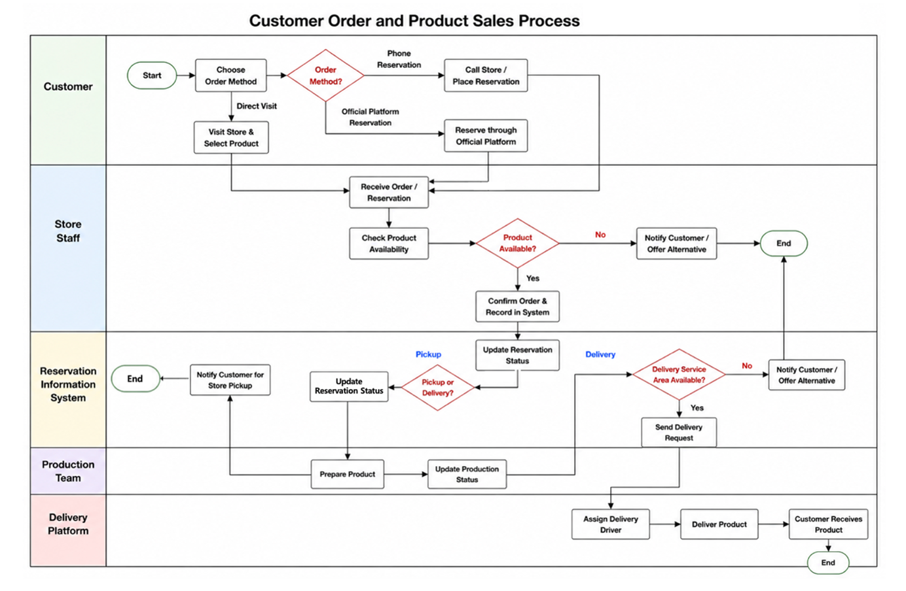
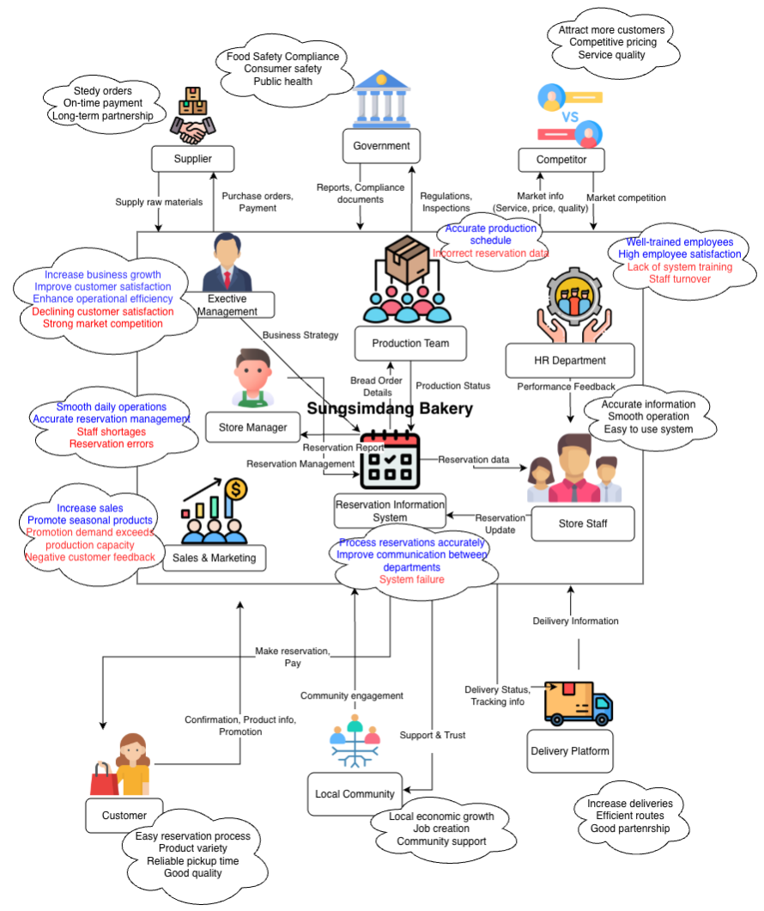
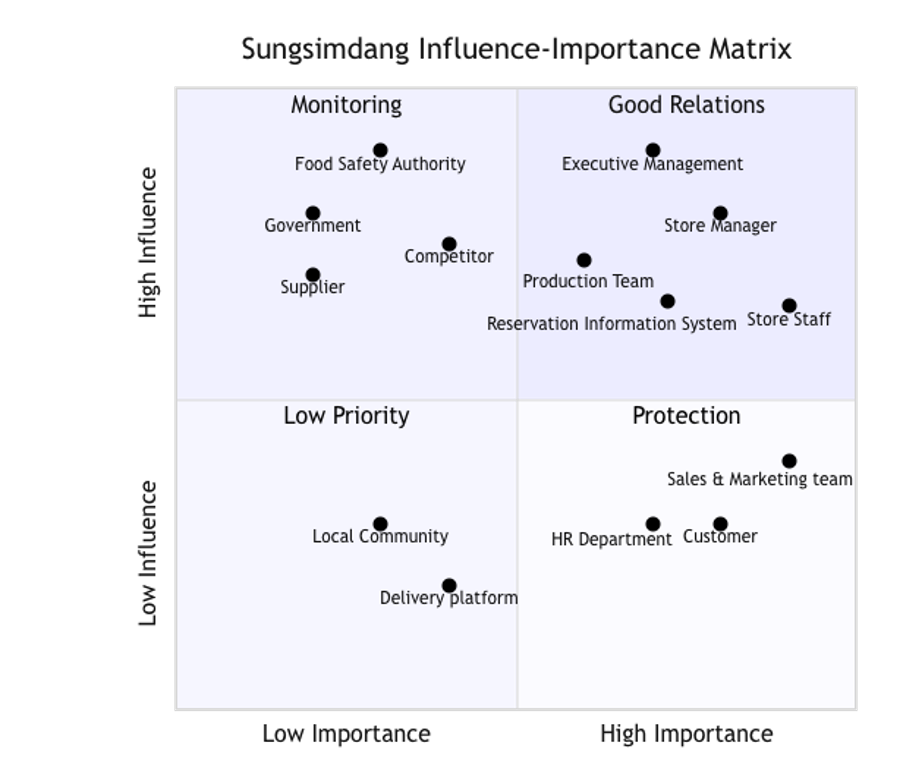

# Information Systems Analysis

An information systems and business process analysis project
based on Sungsimdang.

## Overview

This project investigates Sungsimdang's customer ordering,
reservation and collection processes from an Information Systems
perspective.

The project focuses on:

- Business process analysis
- Stakeholder identification
- Information flow
- Process bottlenecks
- Operational problems
- Information system improvements

Several visual analysis tools were used to understand the
current business process and identify opportunities for improvement.

---

## Business Context

Sungsimdang is a bakery business that manages customer purchases
through multiple channels including in-store sales, reservations
and delivery-related processes.

These activities involve interaction between:

- Customers
- Store staff
- Store managers
- Production teams
- Information systems
- Delivery platforms
- External service providers

Because many stakeholders participate in the same process,
accurate and timely information sharing is important.

---

## Problem Definition

The existing process can become inefficient when information
is not updated or shared quickly enough between ordering channels,
store operations and production activities.

The investigation identified several areas where delays,
inconsistent information and operational congestion could
affect both customers and employees.

---

## Key Stakeholders

Important stakeholders identified during the analysis include:

- Customers
- Store Staff
- Store Manager
- Production Team
- Sales & Marketing
- Human Resources
- Executive Management
- Reservation Information System
- Delivery Platform
- Suppliers
- Payment Provider
- Call Centre

---

## Key Bottlenecks

Several potential problems were identified during the
business process analysis.

### Real-Time Stock Visibility

Stock information may not always be synchronised immediately
between different ordering channels.

This can affect product availability information provided
to customers.

### Multiple Ordering Channels

Orders from different channels can increase the possibility
of duplicated or inconsistent information.

### Reservation and Production Communication

Information delays between reservation activities and
production teams can affect preparation timing.

### Delivery Validation

Delivery service-area validation introduces additional
decision points into the process.

### Address Accuracy

Incorrect or incomplete customer address information
can create delivery problems.

### Store Congestion

High customer demand can create long queues and congestion
inside the store.

---

## Swimlane Diagram

The swimlane diagram maps the customer ordering and product
sales process across different stakeholders.

It helps show:

- Who performs each activity
- Where decisions occur
- How information moves
- How different participants interact

---

## Rich Picture

The rich picture provides a broader visual representation
of the business environment.

It illustrates relationships between:

- Stakeholders
- Business activities
- Information systems
- Operational concerns
- External organisations

---

## Influence–Importance Map

The influence–importance map compares stakeholders according
to their influence on the system and their importance to
the business process.

This helps identify stakeholders that should receive
greater attention during system analysis and improvement.

---

## Proposed Information System

The proposed improvement focuses on better use of
real-time information and operational data.

The proposed system could support:

- Improved stock visibility
- Better coordination between ordering and production
- Faster information sharing
- More accurate customer order information
- Improved delivery validation
- Better operational decision-making

A real-time data analysis approach could help the business
understand product availability, customer demand and order activity.

Privacy protection measures would also be important when
handling customer information across connected systems.

---

## Expected Benefits

Potential benefits of the proposed improvements include:

- Improved product availability information
- Faster communication between business units
- Reduced order duplication
- Better production coordination
- Improved delivery accuracy
- Reduced operational delays
- Improved customer experience
- Better use of business data

---

## Analysis Methods

The project used several Information Systems analysis techniques:

- Business Process Analysis
- Stakeholder Analysis
- Swimlane Diagram
- Rich Picture
- Influence–Importance Map
- Bottleneck Identification
- Information System Proposal

---

## What I Learned

This project improved my understanding of how Information Systems
connect business processes, people and technology.

I gained practical experience with:

- Stakeholder analysis
- Business process modelling
- Information flow analysis
- Identifying business bottlenecks
- Analysing operational problems
- Proposing information system improvements
- Visual modelling techniques
- Communicating complex business processes

I also learned how diagrams such as swimlane diagrams,
rich pictures and influence–importance maps can make
complex business systems easier to understand.

---

## Project Artifacts

This repository contains the following visual analysis artifacts:

- `swimlane-diagram.png`
- `rich-picture.png`
- `influence-importance-map.png`

All project images are stored inside the:

`images/`

directory.

---

## Author

Joel Lee

UTS College  
Diploma of Information Technology
